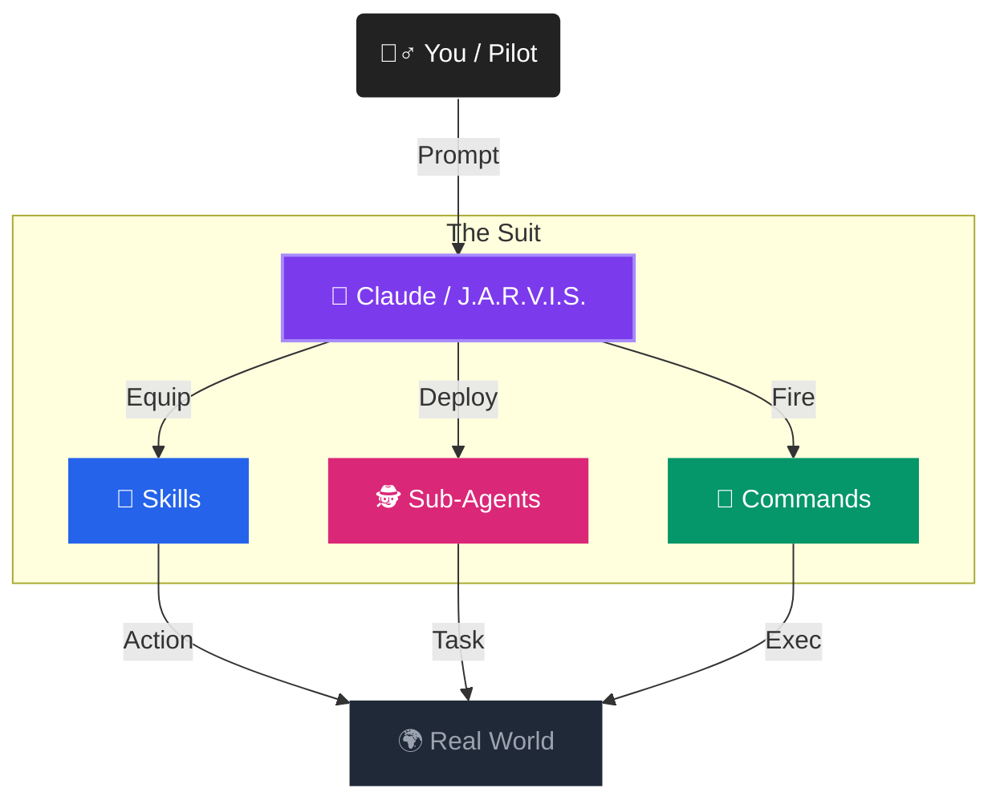

# Claude Code Workshop

Tweak & Deploy in 1 Hour

<div class="pt-12">
  <span @click="$slidev.nav.next" class="px-2 py-1 rounded cursor-pointer hover:bg-white hover:bg-opacity-10">
    Press Space for next page <carbon:arrow-right class="inline"/>
  </span>
</div>

<div class="abs-br m-6 flex gap-2">
  <button @click="$slidev.nav.prev" class="text-xl icon-btn opacity-50 !border-none !hover:text-white">
    <carbon:arrow-left />
  </button>
  <button @click="$slidev.nav.next" class="text-xl icon-btn opacity-50 !border-none !hover:text-white">
    <carbon:arrow-right />
  </button>
</div>

---
transition: fade-out
---

# Agenda

Explore what we'll achieve in this session.

- 🕒 **5 min** - Intro to Claude Code
- 🕒 **10 min** - The Mission: Dashboard Tweak
- 🕒 **30 min** - Hands-on Session
- 🕒 **15 min** - Wrap-up & Learnings

<br>

<div v-click>

### The Goal
Leave this room with a modified, tested, and reported feature in under 60 minutes.

</div>

---

# What is Claude Code?

It's not just a chatbot. It's an **AI Engineer** in your terminal.

<div class="grid grid-cols-2 gap-4 mt-8">
<div>

- **Deep Context**: Understands your entire codebase.
- **Agentic**: Can execute commands, read files, and write code.
- **Safe**: Built with a "human-in-the-loop" safety model.
- **Fast**: High-performance CLI for rapid iteration.


</div>
<div class="border-l border-gray-500 pl-4 bg-gray-900 bg-opacity-80 p-4 rounded shadow">

```bash
# Example usage
claude "add a dark mode toggle to the dashboard"
```

</div>
</div>

---

# The "Iron Man" Architecture

How an AI Engineer actually works.

<div class="grid grid-cols-2 gap-12 mt-4">

<div class="flex flex-col items-center">
  <div class="transform scale-125 origin-top">


  </div>
</div>

<div class="flex flex-col justify-center space-y-6">
  
  <div class="bg-gray-800 bg-opacity-60 border border-gray-600 rounded-xl p-6 shadow-2xl backdrop-blur-sm">
    <h3 class="text-xl font-bold text-blue-400 mb-4 flex items-center">
      <span class="text-2xl mr-2">🧩</span> The Upgrade Module
    </h3>
    <p class="text-gray-300 mb-4 italic">
      "Skills are like snap-on upgrades for your armor."
    </p>
    <ul class="space-y-4">
      <li class="flex items-start">
        <span class="bg-blue-900 text-blue-200 rounded p-1 mr-3 text-sm">ENCAPSULATED</span>
        <span class="text-gray-300 text-sm">Complex logic wrapped in simple natural language.</span>
      </li>
      <li class="flex items-start">
        <span class="bg-purple-900 text-purple-200 rounded p-1 mr-3 text-sm">REUSABLE</span>
        <span class="text-gray-300 text-sm">Write the capability once, use it in any mission.</span>
      </li>
      <li class="flex items-start">
        <span class="bg-green-900 text-green-200 rounded p-1 mr-3 text-sm">SECURE</span>
        <span class="text-gray-300 text-sm">Sandboxed execution protecting the pilot.</span>
      </li>
    </ul>
  </div>

  <div class="text-center text-xs text-gray-500 uppercase tracking-widest">
    System Status: Online
  </div>

</div>

</div>

<div class="mt-4 text-center">
  <p class="text-xl font-medium text-gray-400">
    You provide the <span class="text-purple-400 font-bold">intent</span>, Claude handles the <span class="text-blue-400 font-bold">execution</span>.
  </p>
</div>

---

# The Superpowers

Custom workflows designed for excellence.

| Skill | Purpose |
|---|---|
| **Brainstorming** | Planning features and exploring options before coding. |
| **Coding** | Building features and fixing bugs with deep awareness. |
| **Testing** | Verifying functionality with `webapp-testing`. |
| **Comms** | Reporting progress with `internal-comms`. |

<br>

> "The difference between a good engineer and a great one is the quality of their plan and their verification."

---

# Workshop Activity

We're moving from Idea to Verified Feature.

<div class="flex justify-between items-center mt-12 px-10">
  <div class="flex flex-col items-center">
    <div class="w-20 h-20 rounded-full bg-blue-600 flex items-center justify-center text-white text-2xl font-bold border-4 border-blue-900">1</div>
    <div class="mt-2 font-bold">Plan</div>
    <div class="text-xs opacity-70">Brainstorm</div>
  </div>
  <div class="h-1 w-10 bg-gray-600 mb-6"></div>
  <div class="flex flex-col items-center">
    <div class="w-20 h-20 rounded-full bg-purple-600 flex items-center justify-center text-white text-2xl font-bold border-4 border-purple-900">2</div>
    <div class="mt-2 font-bold">Tweak</div>
    <div class="text-xs opacity-70">Implement</div>
  </div>
  <div class="h-1 w-10 bg-gray-600 mb-6"></div>
  <div class="flex flex-col items-center">
    <div class="w-20 h-20 rounded-full bg-green-600 flex items-center justify-center text-white text-2xl font-bold border-4 border-green-900">3</div>
    <div class="mt-2 font-bold">Verify</div>
    <div class="text-xs opacity-70">Test</div>
  </div>
  <div class="h-1 w-10 bg-gray-600 mb-6"></div>
  <div class="flex flex-col items-center">
    <div class="w-20 h-20 rounded-full bg-orange-600 flex items-center justify-center text-white text-2xl font-bold border-4 border-orange-900">4</div>
    <div class="mt-2 font-bold">Report</div>
    <div class="text-xs opacity-70">Comms</div>
  </div>
</div>

---
layout: center
class: text-center
---

# Ready to Dive In?

Let's open the terminal and start the workshop.

<br>

### Start by asking:
## `"Help me brainstorm a change to the dashboard."`

---
layout: end
---

Thank you!